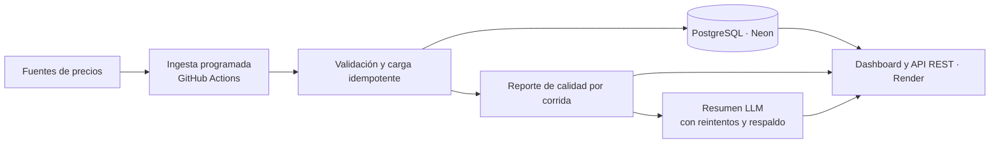

# Copper Market Data Pipeline

Ingesta automática, validada y trazable de precios del cobre (futuro COMEX) y de empresas del sector cobre, con reporte de calidad y resumen en lenguaje natural de cada corrida.

**Demo:** https://copper-market-data-pipeline.onrender.com/
> Plan gratuito de Render: un ping cada 10 minutos mantiene el servicio despierto. Si la instancia se reinició, la primera carga puede tardar unos segundos.

<!-- Captura del dashboard: docs/screenshots/dashboard.png -->

---

## El problema

En minería, el precio del cobre y el desempeño de las empresas del sector condicionan decisiones de inversión, abastecimiento y contratos. Normalmente esos datos se revisan a mano, desde fuentes dispersas y sin registro de si la descarga del día llegó completa.

Este proyecto resuelve la parte que casi nadie documenta: **que el dato llegue, llegue completo y se sepa cuándo no llegó.**

## Qué hace

1. **Ingesta programada** (días hábiles) de precios diarios OHLCV desde fuentes configurables:
   - `cobre-futuro-comex`: futuro del cobre (HG=F).
   - `watchlist-cobre`: FCX, SCCO, BHP, RIO, TECK, GLNCY, COPX, ANTO.L.
2. **Carga idempotente:** restricción única por fuente, instrumento y fecha. Cada corrida distingue **filas nuevas** de **filas actualizadas**, de modo que una re-descarga no infla las métricas.
3. **Reporte de calidad por corrida**, persistido en el momento de la corrida: instrumentos cargados y fallidos, errores por instrumento y tasa de éxito. El histórico se mantiene estable aunque corridas posteriores actualicen los mismos precios.
4. **Resumen en lenguaje natural** generado con un LLM a partir del reporte de calidad. Si el proveedor falla (503, 429 o timeout), el sistema reintenta con backoff y, si persiste, guarda un resumen determinístico: ninguna corrida queda sin resumen.
5. **Consulta** vía dashboard web y API REST: `/api/runs/`, `/api/runs/{id}/quality-report/`, `/api/sources/`, `/api/prices/`.

## Arquitectura



## Decisiones técnicas

- **PostgreSQL desde el día 1:** validaciones y migraciones se prueban contra el mismo motor que corre en producción.
- **Dos mecanismos de programación, a propósito:** Celery + django-celery-beat es la arquitectura para operar a escala (reintentos, colas, estado por tarea). GitHub Actions es lo que corre hoy, porque un worker 24/7 no entra en el plan gratuito.
- **Métricas honestas:** filas nuevas vs actualizadas y estadísticas por instrumento guardadas en cada corrida. Las corridas anteriores a este registro se marcan como `legacy` en vez de mostrar datos reconstruidos.
- **Degradación controlada del LLM:** un fallo del resumen nunca detiene la ingesta.
- **Fuentes configurables desde la base de datos:** agregar un instrumento no requiere tocar código.

## Stack

Python · Django · Django REST Framework · PostgreSQL (Neon) · pandas · yfinance · Gemini API · GitHub Actions · Render · pytest

## Correr localmente

```bash
python -m venv .venv
source .venv/bin/activate
pip install -r requirements.txt
cp .env.example .env   # completar DATABASE_URL, SECRET_KEY, GEMINI_API_KEY
python manage.py migrate
python manage.py run_ingestions_now
python manage.py runserver
```

## Tests

```bash
pytest --cov
```

CI en GitHub Actions contra un Postgres real en cada push y pull request.

## Próximos pasos

- Cadena de proveedores LLM (modelo alternativo y segundo proveedor) con trazabilidad de qué modelo generó cada resumen.
- Disparo exacto de la ingesta desde un scheduler externo (el cron gratuito de GitHub atrasa o descarta ejecuciones).
- Series históricas de completitud por fuente y alertas por fallas consecutivas.
- Integrar series de producción y costos de Cochilco.
